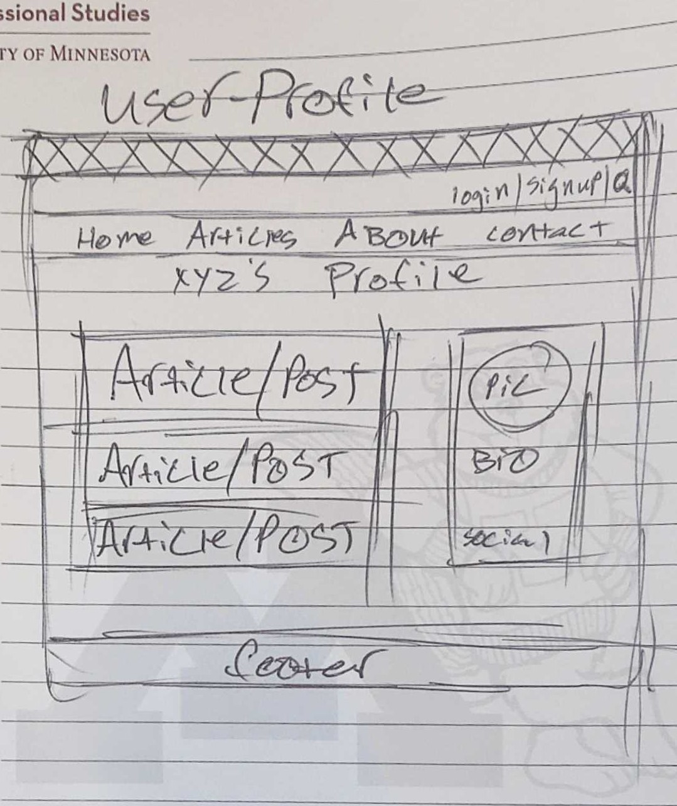
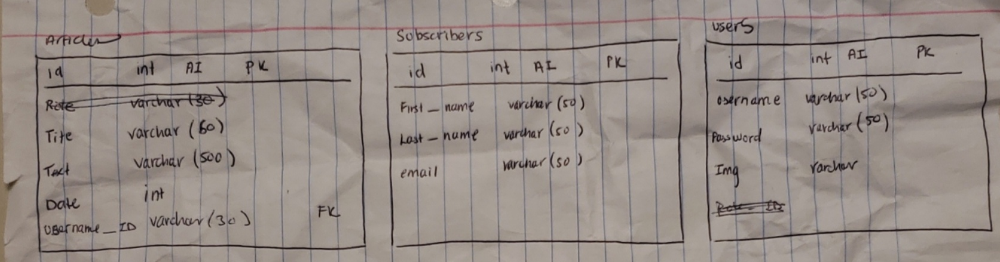
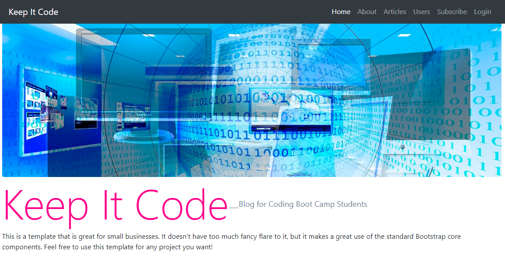
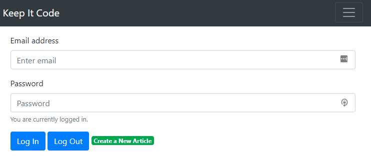

/* eslint-disable */

# Keep It Code

## Index
I) Live site URL
II) Description
III) Usage
IV) Images
V) Installation & Main Tech
i) CDNs
ii) Platforms
iii) Frameworks
iv) Databases
v) ORM
vi) Linters
VI) Contributions
VII) Challenges
VIII) Successes
IX) Roadmap
X) Acknowledgements
XI) License

## Live Site
https://keep-it-code.herokuapp.com/

## Description 
Full stack project to create a blog/news site where web development boot camp students voice opinions and advice.

## Usage
The usage of this application is for 

1. The general public to read about the day in the life of a new web developer (i.e struggles, successes, pearls of wisdom, etc...).

2. Authorized users can log on and write/submit articles

## Images
Starting layout concept (wireframes)

Front-End

Back-End

Finished View:

Login View:

Installation and main Tech:

1. for the general public:

2. for users:

CDNs used: Axios https://unpkg.com/axios/dist/axios.min.js

## Platforms Used

- Heroku: cloud based server for our application

- Firebase: used for user authentication and verification

- Node.js: used for scalability, modularization, vast NPM and third party libraries, etc...

## Frameworks used

- Express: third party library and main server framework for node.js

## Databases 
- MAMP 
- JawsDB

## ORM 
Sequelize, promise based and works well with mySQL

## Linters used

- Husky: manage git hooks

- ESLint: manage problematic code in JavaScript

## Contributions 

For our group project, we had a team of four members: Jake O'Toole - Project Manager & Lead Developer, AyDy Burling - Web Developer, Claudio Garcia - Lead Designer, Mark Sirany - Web Designer.

## Challenges

1. Server and database integration
2. Deployment on Heroku
3. Image conversion, compression and storage in database - non conventional
4. Connection, routes, ports, oh my
5. Smack the server to get what and post how?
   -postman to the rescue
6. Time
   - where's the Eye of Agamotto when you need it?
   - five most dangerous words in the beginning dev stage "Wouldn't it be cool if...?"
7. Authentication and new tech
   - let me learn Firebase real quick

## Successes

Great group dynamic. Effective communication between front-end and back-end. Working application (hopefully).
TO BE CONTINUED...

## Road Ahead

1. Image Storage - Change from converting image to a string to using Firebases storage
2. Database - better setup (foreign keys, joins)
3. Ability for subscribers to donate money

## Acknowledgements
We created this code based on the project requirements by Trilogy Education Services. We have included citations in the form of comments throughout all files.

## License
MIT
